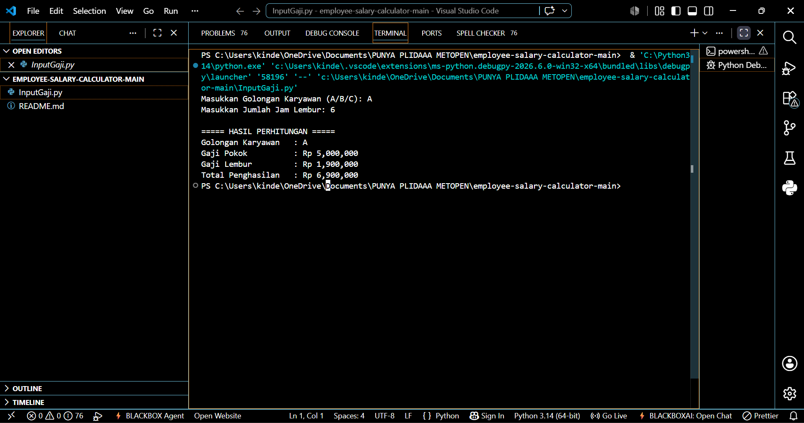
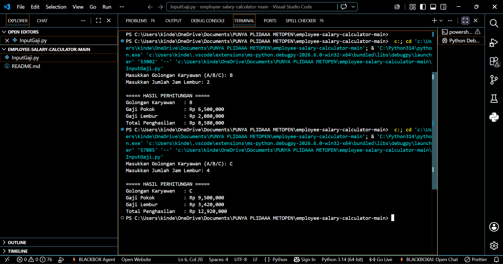

# 💼 Employee Salary Calculator

A Python command-line application that calculates an employee's total income based on job grade and overtime hours. The application applies different overtime rates according to business rules and displays a detailed salary breakdown.

---

## 📸 Preview





---

## ✨ Features

- 💼 Determine base salary based on employee grade (A, B, or C)
- ⏱ Calculate overtime pay based on overtime hours
- 💰 Automatically calculate total salary
- 📊 Display salary breakdown
- 🖥 Simple Command-Line Interface (CLI)

---

## 🛠 Tech Stack

| Technology | Purpose |
|------------|---------|
| Python 3 | Programming Language |
| CLI (Console) | User Interface |

---

## 📂 Project Structure

```text
employee-salary-calculator/
│
├── Asset/
│   ├── python-1.png
│   └── python-2.png
├── InputGaji.py
└── README.md
```

---

## 🚀 Getting Started

Clone the repository.

```bash
git clone https://github.com/Plida05/employee-salary-calculator.git
```

Navigate to the project directory.

```bash
cd employee-salary-calculator
```

Run the program.

```bash
python InputGaji.py
```

---

## 🧾 Sample Output

```text
Enter Employee Grade (A/B/C): C
Enter Overtime Hours: 5

Employee Grade : C
Base Salary    : Rp9,500,000
Overtime Pay   : Rp3,610,000
Total Salary   : Rp13,110,000
```

---

## 🧠 Key Concepts Implemented

- Python Fundamentals
- Variables & Data Types
- User Input Handling
- Conditional Statements
- Arithmetic Operations
- Business Rule Implementation
- Output Formatting

---

## 🎯 Learning Objectives

This project was developed to practice:

- Python Programming Fundamentals
- Problem Solving
- Conditional Logic
- Console Application Development
- Business Rule Implementation

---

## 👩‍💻 Author

**Rr Nabila Fatharani Yuwvrida**

Information Systems Student
